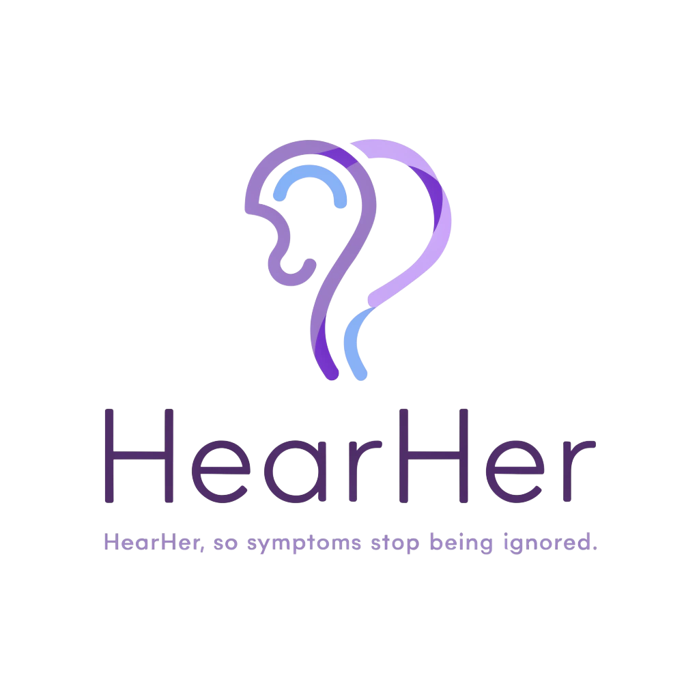

<h1 align="left" style="margin: 0 0 0.25em 0; padding: 0;">
<table>
<tr>
<td style="vertical-align: bottom; border: none; padding: 0 14px 0 0; font-size: inherit; font-weight: inherit;">HearHer</td>
<td style="vertical-align: bottom; border: none; padding: 0;"></td>
</tr>
</table>
</h1>

<p align="left"><em>Hear her. Care, connected.</em> · PCOS &amp; endometriosis education and care coordination (local demo).</p>

**HearHer** helps people living with PCOS or endometriosis track symptoms, prepare for visits, and learn from population-level research—while giving clinicians a structured view of the same journey. It runs as a local web app (patient portal + clinician workspace). Numbers in the UI come from published-style cohort analysis; the app is for **education and care coordination**, not diagnosis.

## What makes HearHer different

We designed around **clinical reasoning**, not “single-lab AI diagnosis”:

| Innovation | What it does |
|------------|----------------|
| **Multi-parameter cohort contextualization** | Clinicians enter cycle pattern, androgen signs, labs, and imaging together—mirroring how PCOS is actually assessed (Rotterdam-style thinking), not one value at a time. |
| **Three-layer Reference readout** | **(1) Clinical phenotype framing** — reproductive / hyperandrogenic / metabolic overlap with published PCOS heterogeneity literature. **(2) Statistical overlap** — in-cohort logistic fit over ~37 numeric fields (ordinal language, e.g. strong/moderate/mixed overlap—not a patient “99% PCOS” score). **(3) Raw cohort comparison** — per-axis bullets vs PCOS-labeled vs non–PCOS-labeled means, collapsed by default. |
| **Exported joint cohort model** | Offline pipeline trains the same tabular logistic model as our analysis scripts and ships `pcos_joint_model.json` for browser-side scoring—measures are linked in one equation while the UI still says *not a diagnosis*. |
| **Patient pattern reflection (no labs)** | Home check-in path uses qualitative prompts (cycles, skin/hair, energy, pain, fertility) for visit prep—warm, non-alarmist copy without turning symptoms into risk percentages. |
| **Translational biology as background** | scRNA-seq inventory and selected UMAP deep dives are framed as *illustrative mechanistic context* for clinicians—not as if the app ran sequencing on the patient in front of you. |
| **Shared patient–clinician story** | Linked accounts: patient check-in summary and clinician dashboard read the same narrative; optional chat privacy; CSV export for visit prep. |

Classifier metrics (ROC-AUC, confusion matrix, coefficients) stay in collapsed **technical details** for researchers—not the primary clinician surface.

## What it offers

**For patients**

- **Check-in** — structured symptom and cycle logs with wording tied to cohort references (not personal risk scores).
- **Support** — narrative chat for emotional support and visit prep (optional OpenAI; built-in replies otherwise).
- **Learn** — flashcards on conditions, labs, and symptom patterns.
- **Community** — moderated posts and replies.
- **Privacy** — control whether linked clinicians can read support chat (check-ins are always available to linked clinicians).

**For clinicians**

- **Dashboard** — link patients by email, review check-ins and summaries, export CSV.
- **Reference** — multi-parameter cohort contextualization (phenotype + joint statistical overlap), PCOS vs endometriosis population context, per-measure lookup, and illustrative single-cell background synced from offline analysis.

Everything runs on your machine (SQLite). No cloud EHR or HIPAA certification is implied.

## Repository layout

| Path | Purpose |
|------|---------|
| [`patient-doctor-portal/`](patient-doctor-portal/) | Web app (FastAPI + SPA) |
| [`backup/`](backup/) | Analysis scripts, reports, sync into the portal |
| [`dataset/`](dataset/) | Raw study files (not in git; [official dataset download](https://entuedu-my.sharepoint.com/:f:/g/personal/bsclub-biohack_e_ntu_edu_sg/IgDu4xUT2v2MRIVfnFuXmmSwAf3BwLHa0QjqJ5TzpMMg2Vg?e=uogCWv)) |

## Run the app

HearHer is a **backend + browser UI**. Install dependencies, start the API server, then open the site in your browser. Cohort stats and Research figures are **already in the repo**—no `dataset/` download required to try it.

```bash
cd patient-doctor-portal
python3 -m pip install -r requirements-api.txt
python3 server.py
```

Requires **Python 3.10+**. On macOS and Linux, use `python3` as above. On Windows, if `python3` is not found, try `python` or `py -3` instead (same commands). Check with `python3 --version` or `python --version`.

Open **http://127.0.0.1:8000**. The same command serves the UI, accounts, check-ins (saved under `data/`), and the clinician **Reference** tab.

### Demo accounts (judges / presentation)

Stop the server first (Ctrl+C), then:

```bash
cd patient-doctor-portal
python3 scripts/reset_demo.py
python3 server.py
```

Clear browser storage for `localhost`, register both accounts below (or sign in if you already seeded locally), and link patient from the clinician dashboard:

| Role | Email | Password |
|------|--------|----------|
| Patient | `patient@gmail.com` | `2026` |
| Clinician | `doctor@gmail.com` | `2026` |

In **Reference**, try **Contextualize profile** with several fields (cycle + androgen signs + AMH or BMI) to see the three-layer readout.

**Optional AI chat**

```bash
cd patient-doctor-portal
cp .env.example .env   # OPENAI_API_KEY=sk-...
python3 server.py
```

Without `.env`, support chat uses built-in fallback replies.

More on features, exports, and troubleshooting: [patient-doctor-portal/README.md](patient-doctor-portal/README.md).

### Files kept out of git

| Path | When you need it |
|------|------------------|
| `patient-doctor-portal/data/` | Created automatically on first run (SQLite + CSV exports) |
| `patient-doctor-portal/.env` | Optional — for OpenAI support chat (see above) |
| `dataset/` | Only if you want to **re-run** analysis from raw files ([official download](https://entuedu-my.sharepoint.com/:f:/g/personal/bsclub-biohack_e_ntu_edu_sg/IgDu4xUT2v2MRIVfnFuXmmSwAf3BwLHa0QjqJ5TzpMMg2Vg?e=uogCWv)) |

## Re-run research pipelines (optional)

To regenerate `researchData.js` and figures from the official study files:

```bash
# From repo root — download files into dataset/ (see backup/README.md for names)
python3 -m pip install pandas numpy scipy scikit-learn matplotlib openpyxl
python3 -m pip install -r backup/requirements-scrna.txt
python3 backup/scripts/run_all_analyses.py
```

That runs tabular PCOS analysis, PCOS vs endometriosis comparison, scRNA inventory, selected Scanpy deep dives, then **syncs and verifies** the portal (including `research-figures/pcos_joint_model.json` for the Reference **joint cohort model** when `dataset/` is present). Hard-refresh the browser after it finishes.

| Pipeline | Headline result |
|----------|-----------------|
| PCOS tabular (n=541) | Logistic regression 5-fold CV, ROC-AUC ~0.94 |
| PCOS vs endometriosis (177 vs 4,079) | Harmonized compare, classifier AUC ~0.73 |
| scRNA inventory | ~81k cells (endometrium + PCOS libraries) |
| scRNA deep (Scanpy) | UMAP/clusters; endometrium cell types; PCOS Mc26 forskolin vs control |

Full pipeline docs: [backup/README.md](backup/README.md)

## More documentation

- App features & CSV export: [patient-doctor-portal/README.md](patient-doctor-portal/README.md)
- Routes and modules: [patient-doctor-portal/WEBSITE_LOGIC.md](patient-doctor-portal/WEBSITE_LOGIC.md)
- Offline analysis & sync: [backup/README.md](backup/README.md)

## Disclaimer

Educational demo only—not medical advice, not a medical device, not HIPAA-compliant, and not for clinical diagnosis.
